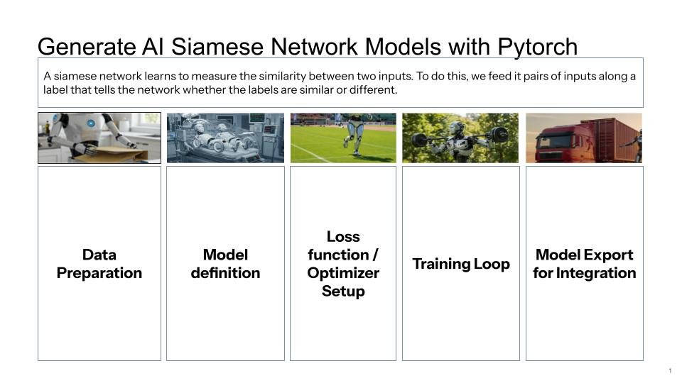

# SignatureGuard ML

A machine learning system for signature verification and forgery detection using Siamese Neural Networks and contrastive learning.

## Overview

SignatureGuard ML is a specialized machine learning project designed to authenticate handwritten signatures by distinguishing between genuine and forged signatures. The system utilizes a Siamese Neural Network architecture trained with a contrastive loss function to learn discriminative embeddings for signature verification.

## Features

- **Signature Verification**: Train models to verify the authenticity of signatures by comparing them against known genuine examples
- **Forgery Detection**: Identify potential forgeries by measuring similarity in embedding space
- **Advanced Visualization**: 
  - Static 3D visualization of signature embeddings using matplotlib
  - Interactive 3D visualization with Plotly for exploring the embedding space
  - Identification of "challenging forgeries" (forgeries most similar to genuine signatures)

## Technical Details

- **Architecture**: Siamese Neural Network for learning signature embeddings
- **Loss Function**: Contrastive Loss to ensure similar signatures are close in embedding space while dissimilar ones are far apart
- **Dimensionality Reduction**: t-SNE for visualizing high-dimensional embeddings in 3D space
- **Framework**: PyTorch for model development and training

## Installation

1. Clone this repository
2. Install the required dependencies:

```bash
pip install -r requirements.txt
```

## Usage

### Training the Model

```bash
python signature_trainer.py
```

This will train the Siamese network on signature pairs (genuine and forged) from the specified directories.

### Visualizing Embeddings (Static)

```bash
python visualize_embeddings.py
```

Creates a 3D visualization of signature embeddings showing the relationship between genuine and forged signatures.

### Interactive Visualization

```bash
python interactive_visualization.py
```

Launches an interactive 3D visualization with Plotly that allows for exploration of the embedding space and highlights challenging forgeries.

## Project Structure

- `signature_trainer.py`: Main training script for the Siamese network
- `siamese_model.py`: Implementation of the Siamese Neural Network architecture
- `contrastive_loss.py`: Implementation of the contrastive loss function
- `data_loader.py`: Handles loading and preprocessing of signature images
- `visualize_embeddings.py`: Static 3D visualization using matplotlib
- `interactive_visualization.py`: Interactive 3D visualization using Plotly
- `logger.py`: Logging functionality for the training process

## Data Format

The project expects signatures to be organized in the following directory structure:

```
dataset_for_training/
├── person1/
│   ├── original/  # Genuine signatures
│   └── forged/    # Forged signatures
├── person2/
│   ├── original/
│   └── forged/
...
```

## Model Outputs

After training, the model is saved in two formats:
- `trained_model/signature_siamese_state_v1.pth`: Just the model state dictionary (recommended)
- `trained_model/signature_siamese_full_v1.pth`: The entire model object

## Requirements

The project relies on the following main dependencies:
- PyTorch
- NumPy
- scikit-learn
- matplotlib
- Plotly
- PIL/Pillow

For a complete list of dependencies, see `requirements.txt`.

## Technical Notes

### PyTorch Tensors

A tensor in PyTorch is essentially a multi-dimensional array that supports various operations on a GPU for fast computation. In image processing, tensors typically have a shape that reflects the image dimensions. For example, after applying transforms.ToTensor(), an image usually becomes a tensor with shape [C, H, W] where C is the number of channels (e.g., 3 for an RGB image or 1 for grayscale), H is the height, and W is the width.